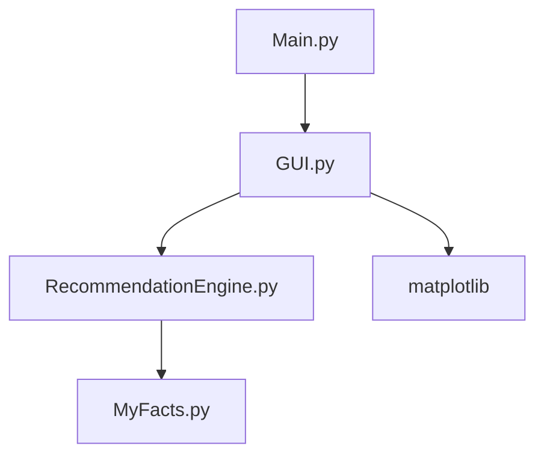

# Project Documentation: Quality Control Recommendation System

## 1. Frameworks & Libraries

### Core Frameworks
- **tkinter**:
  - **Version**: Standard library in Python 3.
  - **Justification**: `tkinter` is used for creating the graphical user interface (GUI). It is a lightweight and straightforward framework, included in the Python standard library, making it a convenient choice for this project without requiring additional dependencies.
  - **Key Features Leveraged**: Basic widgets (windows, labels, entries, buttons), event handling, and layout management.

- **experta**:
  - **Version**: 3.x (assumed based on API usage).
  - **Justification**: `experta` is a Python library for building rule-based expert systems. It is used here as the core of the recommendation engine, allowing for a declarative and flexible way to define the logic for quality control recommendations.
  - **Key Features Leveraged**: Rule-based logic, fact-based state management, and inference engine.

### Critical Dependencies
- **matplotlib**:
  - **Purpose**: Used for data visualization to create charts and graphs within the `tkinter` GUI.
  - **Version Constraints**: No specific version constraints are mentioned, but a version compatible with `tkinter` is required.
  - **Alternatives Considered**: Other libraries like `seaborn` or `plotly` could have been used, but `matplotlib` provides sufficient functionality for this project and integrates well with `tkinter`.

### Dev Tools
- **Testing**: No dedicated testing framework is used in this project. Testing appears to be manual.
- **Build**: No specific build tools are used. The project is run directly from the Python scripts.
- **Deployment**: The application is designed to be run locally, so no deployment tools are necessary.

## 2. Architectural Blueprint

### Diagram-Worthy Structure Overview

### Key Modules/Components and Their Responsibilities
- **`Main.py`**: The entry point of the application. It initializes and runs the `tkinter` application.
- **`GUI.py`**: Implements the user interface using `tkinter`. It is responsible for gathering user input, displaying questions, and presenting the final recommendations and visualizations.
- **`RecommendationEngine.py`**: The core of the application's logic. It uses the `experta` library to define rules for analyzing the quality control data and generating recommendations.
- **`MyFacts.py`**: Defines the data structures (facts) used by the `experta` engine to store and manage the state of the system.
- **`matplotlib`**: Used by `GUI.py` to create and display charts that visualize the defect data.

### Data Flow Patterns
The application follows a pattern similar to **Model-View-Controller (MVC)**:
- **Model**: The `RecommendationEngine.py` and `MyFacts.py` represent the model, containing the business logic and data.
- **View**: The `GUI.py` is the view, responsible for the presentation layer.
- **Controller**: The `App` class within `GUI.py` acts as the controller, handling user input and mediating between the view and the model.

### Concurrency/State Management Approach
State is managed by the `experta` knowledge engine. The engine maintains a set of "facts" that represent the current state of the system. Rules in the engine are triggered by patterns in these facts, and the execution of rules can modify the state by adding, removing, or changing facts.

## 3. Code Deep-Dive

### Critical File Analysis
- **`RecommendationEngine.py`**: This file is the heart of the system. It defines a `RecommendationEngine` class that inherits from `experta.KnowledgeEngine`. It uses `@Rule` decorators to define the logic for when to ask questions, validate inputs, and generate recommendations. The use of `salience` is important for controlling the order in which rules are fired.
- **`GUI.py`**: This file handles all aspects of the user interface. It creates the main application window, manages the flow of questions, and displays the results. It also integrates `matplotlib` to show graphical representations of the data.

### Key Algorithms/Patterns with Complexity Analysis
- **Rule-Based Inference**: The core algorithm is the forward-chaining inference used by the `experta` engine. The complexity of this algorithm is dependent on the number of rules and facts. In this case, the number of rules is fixed, so the complexity is roughly proportional to the number of facts declared.
- **Certainty Factor (CF)**: The system calculates a "certainty factor" for each defect. This is a simple form of confidence scoring, where the CF is based on the proportion of a specific defect relative to the total number of defects.

### Error Handling Strategy Implementation
- **Input Validation**: The `GUI.py` file has a `validate_answer` method to check if the input is of the correct type (e.g., an integer).
- **Logical Validation**: The `RecommendationEngine.py` contains rules to validate the logical consistency of the input data. For example, it checks that the sum of individual defect counts does not exceed the total number of defects. If an inconsistency is found, it retracts the incorrect facts and re-asks the relevant questions.

## 4. Problem-Solution Matrix

| Problem Area | Symptom | Root Cause | Solution Implemented |
|--------------|---------|------------|----------------------|
| User Input Error | Application shows an error message or behaves unexpectedly. | User provides non-numeric or logically inconsistent data. | The `GUI.py` validates input types, and `RecommendationEngine.py` has rules to check for logical inconsistencies and re-prompt the user. |
| Inconsistent Defect Data | The sum of individual defects does not match the total number of defects reported. | User misenters the data for one or more defect types. | The `RecommendationEngine.py` has a validation rule that retracts all defect-related facts and re-asks the questions if the sum is incorrect. |
| Rule Priority Conflict | The engine provides a suboptimal recommendation because rules are not fired in the correct order. | The `experta` engine does not guarantee the order of rule execution without explicit guidance. | The `salience` parameter is used in the rule definitions to control the priority of rules, ensuring that more critical rules are fired first. |

## 5. Innovation Spotlight

### Novel Approaches vs. Standard Industry Solutions
The use of a Python-based expert system (`experta`) for a quality control application is a novel approach. Many industrial systems would rely on hard-coded logic or statistical process control (SPC) charts. The expert system approach allows for a more flexible and human-readable representation of the quality control logic.

### Performance Benchmarks
No performance benchmarks are available for this project. However, given the small number of rules and facts, the performance is expected to be more than adequate for this application.

### Extensibility/Scaling Advantages
The rule-based architecture of the `RecommendationEngine` is highly extensible. New rules can be added to handle new types of defects or to refine existing recommendations without requiring changes to the core application logic. This makes the system easy to maintain and update as quality control procedures evolve.
